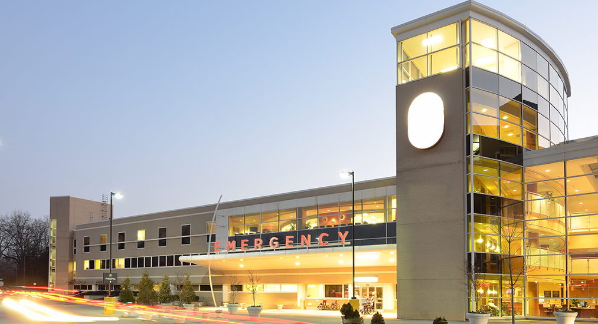
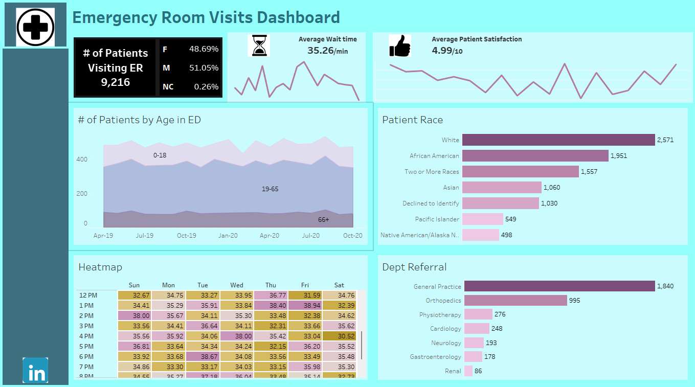

# Analysis of Patient Visits and Service Efficiency in the Emergency Room

## Introduction

This Tableau Project provides a detailed overview of 9,216 patient emergency room (ER) visits, offering valuable insights into patient demographics, wait times, satisfaction levels, department referrals and overall hospital performance. By analyzing these patterns, I have identified several areas where improvements can be made to enhance patient satisfaction and streamline emergency room operations.

## Problem Statement

Emergency rooms (ERs) play a crucial role in providing immediate medical attention to patients. However, high patient volumes, varying demographics, and diverse medical needs can challenge the efficiency and effectiveness of ER operations. The objective of this project is to analyze ER visit data to identify key trends, patient demographics, wait times, satisfaction levels, and departmental referrals.

This project seeks to address the following questions:
1. What are the primary demographics of patients visiting the ER?
2. How do wait times impact patient satisfaction?
3. What are the peak times and days for ER visits?
4. Which departments receive the most referrals from the ER?
5. How can the insights gained be used to enhance the efficiency and effectiveness of ER operations?

## Skills

The following Tableau features were incorporated:
- Calculated Fields: Creating custom calculations for metrics such as average wait times and satisfaction scores.
- Filters: Implementing filters to allow users to view data for specific time periods, patient demographics, and departments.
- Interactive Dashboards: Designing interactive dashboards that users can navigate and explore.
- Heatmaps: Utilizing heatmaps to visualize wait times by hour and day, highlighting peak periods.
- Bar Charts: Displaying department referrals and patient age distribution using bar charts.
- Line Graphs: Showing trends in wait times and satisfaction scores over time.
- Maps: Visualizing the geographical distribution of patients using maps.
- Actions: Implementing actions to create dynamic interactions between different visualizations.
- Tooltips: Adding detailed tooltips to provide additional information when hovering over data points.
  

## Data Sources
The dataset used for this analysis was from data.world [here](https://data.world/markbradbourne/rwfd-real-world-fake-data/workspace/file?filename=Hospital+ER.csv)

## Visualization

Link to the Interative Dashboard [here](https://public.tableau.com/app/profile/stella.olasehinde1199/viz/EmergencyroomDashborad/Dashboard1)

- Weekday vs. Weekend Visits
Unsurprisingly, most visits (6,574) occurred during the week, with fewer (2,642) on the weekends. This indicates a typical weekday rush that needs careful staffing and resource management to avoid burnout while keeping patient care efficient.

- Age Groups
Adults dominate the visits (7,106), but there’s also a significant number of children coming in, especially in the middle childhood category. This suggests that while adult care should be the focus, pediatric emergency care must remain a priority as well.

- Satisfaction and Wait Times
The average satisfaction score is 5.47—not bad, but not great either. I noticed that the long 35.26-minute wait time could be a factor. Reducing this will likely increase overall patient satisfaction.

- Patients Visits by Year
A steady increase from 2019 to 2020 points towards growing demand. We should prepare for future surges, especially as healthcare needs keep evolving post-pandemic.

- Department Referrals
Interestingly, most patients were not referred to any specific department (5,400). General Practice handled the bulk of referrals (1,840), but there’s a noticeable drop-off in specialized areas like Orthopedics and Cardiology. There may be opportunities here to distribute patient loads more evenly across departments.

- Demographics
Gender distribution is quite balanced, but there's an opportunity to explore why the satisfaction scores fluctuate more for certain age groups and races. This can help pinpoint areas of improvement in personalized care.

## Recommendations
1. Shorten wait times: Prioritizing this will directly boost patient satisfaction and overall hospital performance

2. Weekday staff management: Given the weekday influx, we need to ensure optimal staffing during peak times and reassess weekend staffing strategies.

3. Plan for growth: The rising number of visits means it's essential to expand capacity and be prepared for future spikes in patient demand.

4. Optimize department referrals: There’s room to improve referral processes and ensure patients are evenly distributed among departments to avoid overburdening General Practice.

## Conclusion
From the analysis, a few important areas for improvement stand out. First, it's clear that longer wait times are directly affecting patient satisfaction, so reducing these delays should be a top priority for boosting the overall patient experience. Additionally, the data shows that most visits happen during the weekdays, with a higher proportion of adult patients. This means resources should be allocated with these trends in mind, while still being flexible enough to handle pediatric and weekend cases.

The steady increase in patient visits from 2019 to 2020 indicates that healthcare facilities need to plan ahead to accommodate this growing demand and ensure that they have the capacity to meet future needs. Finally, the fact that so many patients aren't being referred to specific departments raises some concerns about how triage is being managed. Better balancing patient loads across different specialties could lead to more efficient service.

By focusing on these areas, we can make meaningful improvements in the overall efficiency, patient satisfaction, and service delivery within the emergency room department.😄

.jpg)

