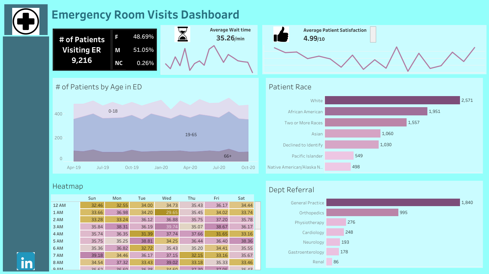

# Analysis of Patient Visits and Service Efficiency in the Emergency Room

## Introduction

This Tableau Project provides a detailed overview of 9,216 patient emergency room (ER) visits, offering valuable insights into patient demographics, wait times, satisfaction levels, department referrals and overall hospital performance. By analyzing these patterns, I have identified several areas where improvements can be made to enhance patient satisfaction and streamline emergency room operations.

## Problem Statement

Emergency rooms (ERs) play a crucial role in providing immediate medical attention to patients. However, high patient volumes, varying demographics, and diverse medical needs can challenge the efficiency and effectiveness of ER operations. The objective of this project is to analyze ER visit data to identify key trends, patient demographics, wait times, satisfaction levels, and departmental referrals.

This project seeks to address the following questions:
1. What are the primary demographics of patients visiting the ER?
2. How do wait times impact patient satisfaction?
3. What are the peak times and days for ER visits?
4. Which departments receive the most referrals from the ER?
5. How can the insights gained be used to enhance the efficiency and effectiveness of ER operations?

## Skills

The following Tableau features were incorporated:
- Calculated Fields: Creating custom calculations for metrics such as average wait times and satisfaction scores.
- Filters: Implementing filters to allow users to view data for specific time periods, patient demographics, and departments.
- Interactive Dashboards: Designing interactive dashboards that users can navigate and explore.
- Heatmaps: Utilizing heatmaps to visualize wait times by hour and day, highlighting peak periods.
- Bar Charts: Displaying department referrals and patient age distribution using bar charts.
- Line Graphs: Showing trends in wait times and satisfaction scores over time.
- Maps: Visualizing the geographical distribution of patients using maps.
- Actions: Implementing actions to create dynamic interactions between different visualizations.
- Tooltips: Adding detailed tooltips to provide additional information when hovering over data points.
  

## Data Sources
The dataset used for this analysis was from data.world [here](https://data.world/markbradbourne/rwfd-real-world-fake-data/workspace/file?filename=Hospital+ER.csv)

## Visualization

